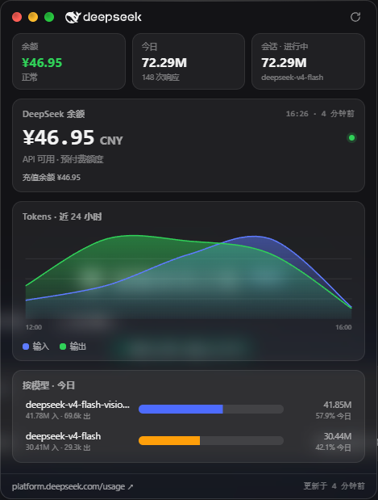
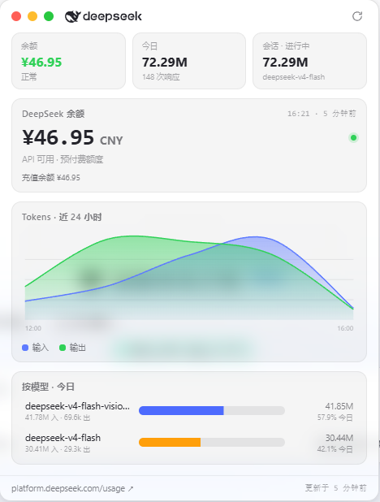

<h1 align="center">DSH-USAGE-PANEL</h1>

<p align="center">
  &ensp;
  &ensp;
  &ensp;
  &ensp;
  
</p>

> 📌 版本更新：见 [doc/ver/0.2.1.md](doc/ver/0.2.1.md)

> 🪟 DeepSeek Harness（DSH）Web 悬浮用量面板 —— 未央最爱的 macOS 毛玻璃 · 中文界面 · 官方余额 · Token 用量曲线。

Floating macOS-glass **usage panel** for DeepSeek Harness Web: live official
balance + token usage (today / session / 24 h smooth trend / per-model).
`Token` 等有歧义名词未做翻译。

## 📸 效果预览

<p align="center">
  &nbsp;
</p>

## ✨ 功能

- 💰 **官方余额**：轮询 `GET /user/balance`，只显示官方字段（当前余额、充值余额）。
- 📊 **Token 用量**：今日 / 会话 / 近 24 小时平滑曲线（输入·输出，含缓存命中/未命中明细）/ 按模型占比。
- 🖱️ **交互**：胶囊 ⇄ 面板拖动；点击 / 红绿灯 / `ESC` 收起（带过渡动画）；面板按胶囊位置自动选择展开方向；↻ 一键刷新（旋转 + 「已刷新」反馈）。
- 🚫 无需频繁打开 platform.deepseek.com/usage。

## 📦 安装与卸载

### 安装

```bash
# 方式一：在线安装（推荐）
dsh plugin --profile web add dsh-deepseek-usage-panel

# 方式二：从源码安装
dsh plugin --profile web add "link:/你的路径/dsh-deepseek-usage-panel"
```

装完重启 `dsh web` 并硬刷新浏览器（`Ctrl/Cmd + Shift + R`）。若未自动加入
bundle，把 `dsh-deepseek-usage-panel` 追加到 profile `package.json` 的
`dsh.profile.bundles`。

**API Key（余额必需）** —— 在 `~/.dsh/.credentials.yaml` 配置（插件直读，不注入浏览器）：

```yaml
version: 1
refs:
  DEEPSEEK_API_KEY: sk-你的key
```

也可设置环境变量 `DEEPSEEK_API_KEY` 或 `DSH_USAGE_HUD_API_KEY`。

### 卸载

```bash
# 方式一：CLI 卸载（移除依赖与 bundles 项）
dsh plugin --profile web remove dsh-deepseek-usage-panel

# 方式二：手动清理
pnpm --dir C:\Users\Administrator\.dsh\profiles\web remove dsh-deepseek-usage-panel
# 并手动把 package.json 的 dsh.profile.bundles 中的 "dsh-deepseek-usage-panel" 移除
```

重启 `dsh web` 即完全生效。（可选）删除本地数据目录
`$DSH_HOME/dsh-deepseek-usage-panel/` 或 `<profile>/.dsh-usage/` 以清理历史用量记录。

## 🖱️ 使用

- 右下角胶囊显示 余额 / 今日 / 会话，可拖动、位置自动记忆。
- 轻点胶囊展开面板：余额卡、近 24 小时曲线、按模型统计、DeepSeek 用量页链接。
- 三个 MAC 圆点或 `ESC` 收起；右上 ↻ 立即刷新。

## ⚙️ 配置项

在 profile 的 `cordis.patch.yml` 中按行 id 覆盖：

```yaml
- id: usage-panel
  config:
    pollIntervalMs: 300000   # 余额轮询间隔（毫秒，最小 60000）
    historyHours: 72         # 历史小时桶保留数
    baseURL: https://api.deepseek.com   # 覆盖接口地址
    apiKeyRef: DEEPSEEK_API_KEY         # 凭据引用名
    dataDir: null            # 覆盖数据目录（默认 $DSH_HOME/dsh-deepseek-usage-panel）
```

## 🔒 数据与隐私

- 🔑 API Key 仅存在于宿主（Node）进程，浏览器只收到解析后的余额快照。
- 🗄️ 用量历史写入数据目录 `state.json`（原子写入、自动裁剪），更换安装方式自动迁移旧数据。
- 🌐 网络请求：每轮询周期一次官方余额接口；无其它外发流量。

### 📏 数据口径（请一定了解）

「今日 / 近 24 小时 / 按模型 / 会话」的 Token 数据是**本插件对 Harness 会话的本地测量**，
**不是 DeepSeek 平台的官方账目**，因此可能与 platform.deepseek.com/usage 的数字存在差异。原因如下：

1. **观测窗口**：插件从「它运行起来之后的时刻」开始统计；当天若**安装较晚、中途重装/重启过 dsh web**，
   在这些时间点**之前**产生的请求，本地拿不到（DeepSeek 未提供官方用量 API，无法补齐）。
   —— 表现为“今日/近 24h”可能**偏小于**官方全天金额。
2. **口径单条一致**：每条响应使用 DeepSeek 返回的 `usage`（未命中输入 + 缓存命中输入 + 输出含推理），
   与官方计费同源；所以**单条记录的 token 计算是准的**，偏差主要来自“**统计时间窗口不完整**”，而非算错。
3. **模型占比可能失真**：如果某段时间（例如上午）未被插件覆盖，而那段恰好以某个模型/缓存命中为主，
   就会让“按模型”占比与实际全天不同。
4. **“会话”≠“今日”**：会话是**当前会话的累计值（可跨天/多轮）**，不是自然日口径，不能与日账单直接比较。
5. **按本地时区零点切分“今日”**：若你与官方账单的时区口径不同，临近午夜会差一截。
6. 缓存命中（`cacheReadTokens`）单独列出；输出含推理 token，均与官方分桶一致。

> 结论：**数字可信的方向是“相对趋势/构成”，绝对总量请以官方 usage 页为准。**
> 我们计划在后续版本中加入「统计自插件启用时间 / 完整性提示（完整 or 可能不完整）/ 手动重置」，
> 让口径更透明。若你对某天数据差异有疑问，可按“统计窗口”理解，而非视为错误。


## 📄 许可

MIT License —— 见 [LICENSE](LICENSE)。
